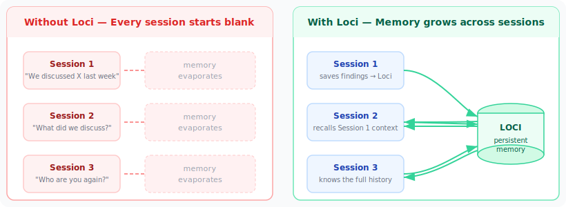
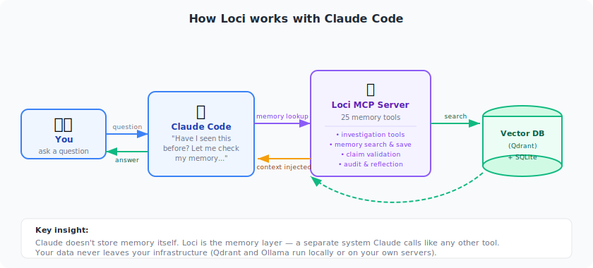
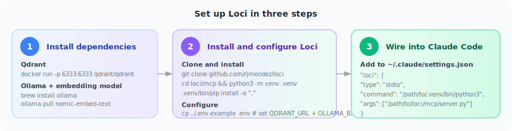
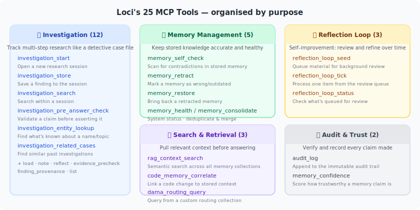

# Loci — Persistent Memory for AI Agents

**Loci gives AI agents like Claude a long-term memory that survives across sessions.**

Without it, every conversation starts from zero — no history, no accumulated knowledge,
no memory of what you tried and why. With Loci, sessions build on each other. Decisions,
findings, and context persist in a searchable memory store that Claude can read and write
like a set of notes.



---

## What it unlocks

- **Continuity** — Session 7 knows what happened in Sessions 1–6, without you re-explaining
- **Grounded answers** — Claude checks stored history before answering, reducing hallucinations
- **Claim validation** — Verify a proposed answer against stored evidence before asserting it
- **Accumulated knowledge** — Your project context grows richer with every session
- **Multi-agent memory** — Multiple AI agents can share a common memory pool via the A2A server
- **Supply chain security** — Every tool call is scanned for injection attacks and malicious patterns

---

## How it works



Loci runs as an MCP server alongside Claude Code. When Claude needs to remember or recall
something, it calls one of Loci's 25 tools — the same way it calls any other tool. Your
data stays on your own infrastructure: Qdrant and Ollama run locally or on your own server.

> **New to terms like "vector search", "RAG", or "MCP"?**
> Start with **[docs/CONCEPTS.md](docs/CONCEPTS.md)** — a plain-English guide that explains
> everything from scratch with no assumed knowledge.

---

## Quick start



```bash
git clone https://github.com/rjmendez/loci
cd loci/mcp
python3 -m venv .venv && .venv/bin/pip install -e "."
cp ../.env.example .env   # fill in QDRANT_URL and OLLAMA_BASE_URL at minimum
.venv/bin/python server.py
```

Wire into Claude Code (`~/.claude/settings.json`):

```json
"loci": {
  "type": "stdio",
  "command": "/path/to/.venv/bin/python3",
  "args": ["/path/to/loci/mcp/server.py"],
  "env": {
    "QDRANT_URL": "http://localhost:6333",
    "OLLAMA_BASE_URL": "http://localhost:11434"
  }
}
```

See [mcp/README.md](mcp/README.md) for the full tool reference and wiring guide.
See [docs/DEPLOYMENT.md](docs/DEPLOYMENT.md) for Docker and systemd deployment.

---

## Quick orientation

| What you want | Where to look |
|---|---|
| New to all of this — start here | [docs/CONCEPTS.md](docs/CONCEPTS.md) |
| How the system works (technical) | [docs/ARCHITECTURE.md](docs/ARCHITECTURE.md) |
| Why it's designed this way | [docs/COGNITIVE_FOUNDATIONS.md](docs/COGNITIVE_FOUNDATIONS.md) |
| What each script does | [docs/COMPONENTS.md](docs/COMPONENTS.md) |
| How to run / configure (scripts) | [docs/OPERATIONS.md](docs/OPERATIONS.md) |
| How to deploy (Docker / systemd) | [docs/DEPLOYMENT.md](docs/DEPLOYMENT.md) |

---

## MCP tools (24)



| Tool | Purpose |
|---|---|
| `investigation_start` | Open a new investigation session |
| `investigation_load` | Load an existing investigation by ID |
| `investigation_store` | Persist findings to the investigation |
| `investigation_note` | Append a free-form note |
| `investigation_reflect` | Run reflection over current findings |
| `investigation_search` | Search within an investigation |
| `investigation_pre_answer_check` | Validate a claim against stored evidence before answering |
| `investigation_evidence_precheck` | Pre-screen evidence before ingestion |
| `investigation_entity_lookup` | Look up an entity by name across stored findings |
| `investigation_related_cases` | Find related prior investigations |
| `investigation_finding_provenance` | Trace source provenance for a finding |
| `investigation_list` | List all investigations |
| `audit_log` | Append to the audit trail |
| `memory_self_check` | Cross-check stored memories for consistency |
| `code_memory_correlate` | Correlate a code change with stored memory context |
| `memory_health` | Report memory system health |
| `memory_retract` | Soft-retract an incorrect or stale memory |
| `memory_restore` | Restore a previously retracted memory |
| `reflection_loop_seed` | Seed the reflection loop with new material |
| `reflection_loop_tick` | Advance the reflection loop one step |
| `reflection_loop_status` | Report reflection loop queue status |
| `rag_context_search` | Fan-out semantic search across all configured Qdrant collections |
| `memory_consolidate` | Trigger memory consolidation (dedup + merge) |
| `memory_confidence` | Estimate confidence in a memory-derived claim before asserting it |

---

## A2A skills (13)

The A2A server exposes 13 skills via JSON-RPC 2.0 over HTTP, letting peer agents share
memory without requiring the MCP stack. Twelve are advertised in the agent card;
`memory_prime` is callable but not listed in discovery.

| Skill | Advertised |
|---|---|
| `memory_recall` | Yes |
| `memory_remember` | Yes |
| `memory_stats` | Yes |
| `session_search` | Yes |
| `memory_sleep` | Yes |
| `rag_search` | Yes |
| `context_broadcast` | Yes |
| `mnemosyne_triple_add` | Yes |
| `mnemosyne_triple_query` | Yes |
| `gpu_inference` | Yes |
| `docker_status` | Yes |
| `ua_search` | Yes |
| `memory_prime` | No |

---

## Infrastructure

| Resource | Default | Env var(s) |
|---|---|---|
| Qdrant | `http://localhost:6333` | `QDRANT_URL`, `QDRANT_API_KEY` |
| Ollama (MCP server) | `http://localhost:11434` | `OLLAMA_BASE_URL` |
| Ollama (standalone scripts) | `http://localhost:11434` | `OLLAMA_URL` |
| Ollama (A2A server) | `http://localhost:11434/v1` | `MNEMOSYNE_EMBEDDING_API_URL` |
| Embedding model (MCP) | `nomic-embed-text` | `EMBED_MODEL` |
| Embedding model (A2A) | `nomic-embed-text` | `MNEMOSYNE_EMBEDDING_MODEL` |
| Embedding dimensions | `768` | `MNEMOSYNE_EMBEDDING_DIM` |
| Mnemosyne DB | `~/.hermes/mnemosyne/data/mnemosyne.db` | `MNEMOSYNE_DATA_DIR` |
| Memory session dir (MCP) | `~/.hermes/memory-sessions` | `HERMES_MEMORY_DIR` |
| Qdrant collection prefix | `hermes_memory` | `QDRANT_COLLECTION_PREFIX` |
| Hook state | `~/.claude/hook-state/` | — |

`OLLAMA_BASE_URL` and `OLLAMA_URL` serve different components — set both when running
the full stack. See [docs/OPERATIONS.md](docs/OPERATIONS.md) for the full env var reference.

Two `.env.example` files are provided:

- **`.env.example`** (repo root) — complete reference covering all components
- **`mcp/.env.example`** — minimal file for MCP-server-only deployments

---

## Key env vars

### MCP server

| Variable | Default | Purpose |
|---|---|---|
| `QDRANT_URL` | _(required)_ | Qdrant instance URL |
| `QDRANT_API_KEY` | `""` | Qdrant auth key (blank for no-auth) |
| `QDRANT_COLLECTION_PREFIX` | `hermes_memory` | Main Qdrant collection name |
| `OLLAMA_BASE_URL` | _(required for embeddings)_ | Ollama base URL (no trailing `/v1`) |
| `EMBED_MODEL` | `nomic-embed-text` | Embedding model for MCP server |
| `EMBED_API_KEY` | `""` | Cloud embedding provider API key |
| `EMBED_API_KEY_HEADER` | `Authorization` | Auth header name for cloud embeddings |
| `HERMES_MEMORY_DIR` | `~/.hermes/memory-sessions` | Investigation session storage root |
| `MNEMOSYNE_EMBEDDING_DIM` | `768` | Vector dimension — must match your model |
| `CODE_CHUNKS_COLLECTION` | _(unset)_ | Qdrant collection for `code_memory_correlate` |
| `HERMES_MCP_TRANSPORT` | `stdio` | Transport mode: `stdio`, `sse`, or `streamable-http` |
| `HERMES_MCP_HOST` | `0.0.0.0` | Bind host for SSE/HTTP transport |
| `HERMES_MCP_PORT` | `8000` | Bind port for SSE/HTTP transport |

### A2A server

| Variable | Default | Purpose |
|---|---|---|
| `MNEMOSYNE_EMBEDDING_API_URL` | _(required)_ | OpenAI-compat embedding endpoint (e.g. `http://localhost:11434/v1`) |
| `MNEMOSYNE_EMBEDDING_MODEL` | `nomic-embed-text` | Embedding model for A2A server |
| `MNEMOSYNE_DATA_DIR` | `~/.hermes/mnemosyne/data` | Mnemosyne SQLite data directory |
| `HERMES_A2A_TOKEN` | _(required)_ | Bearer token callers must present |
| `HERMES_A2A_TOTP_SEED` | `""` | TOTP base32 seed (blank to disable) |
| `HERMES_A2A_URL` | `http://127.0.0.1:8201` | Public URL injected into the agent card |
| `HERMES_AGENT_ID` | `hermes-agent` | Agent identity stamped on all writes |
| `EXTRA_RAG_COLLECTIONS` | `""` | Comma-separated extra Qdrant collections for fan-out RAG |
| `PEER_A2A_URLS` | `""` | Comma-separated peer A2A endpoints for context broadcast |

---

## Qdrant collections

| Collection | Purpose |
|---|---|
| `hermes_memory` (configurable via `QDRANT_COLLECTION_PREFIX`) | Primary long-term memory store |
| `hermes_sessions` | Session history embeddings |
| `hermes_verdicts` | Claim verdict history for `investigation_pre_answer_check` and `memory_self_check` |
| `mnemosyne` | Synced Mnemosyne SQLite vectors |

---

## MCP transport modes

By default the MCP server runs over `stdio` for use as a Claude Code subprocess.
For Docker or remote deployments set `HERMES_MCP_TRANSPORT=sse` (or
`streamable-http`) and configure `HERMES_MCP_HOST` / `HERMES_MCP_PORT`.

```bash
HERMES_MCP_TRANSPORT=sse HERMES_MCP_HOST=0.0.0.0 HERMES_MCP_PORT=8000 \
  .venv/bin/python server.py
```

---

## Repo layout

```
loci/
├── mcp/                   MCP server — 25 tools: investigation memory, RAG, claim validation
│   ├── server.py          FastMCP server entry point
│   ├── memcheck/          Standalone claim-validation + code-hallucination module
│   ├── pyproject.toml     Package definition (pip install -e .)
│   └── README.md          MCP setup and tool reference
├── docs/                  Architecture, theory, component reference, ops guide
│   ├── CONCEPTS.md        Plain-English guide for beginners
│   └── img/               SVG diagrams
├── scripts/               Python scripts (run standalone or via cron)
│   └── hooks/             Claude Code / agent hook adapters
├── eval/                  Longitudinal grounding quality evaluation harness
├── deep_think_loci/       Multi-tier reasoning engine — Workflow over the Loci corpus (beta)
├── a2a_server/            A2A RAG broadcast server (mesh-wide context sharing)
├── rules/                 Agent behavioral rules (loaded at session start)
├── cron/jobs.json         (reference copy — live file in ~/.hermes/cron/)
└── .env.example           Full environment variable reference for all components
```
