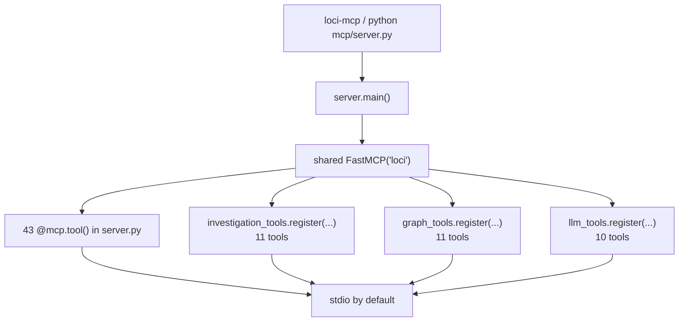

# Loci call graph and runtime paths

This page is the source of truth for the shipped MCP registration surface and
the relationship between Loci's two graph systems. It describes `origin/main`,
not features that exist only on an unmerged pull request.

## Runtime dispatch and registration

`mcp/server.py` creates one shared `FastMCP("loci")` instance, decorates 43
server-local tools, imports the registration modules, and passes that same
instance to each module. The resulting runtime surface is **75 tools**:

| Registration surface | Count | Source-checked anchor |
|---|---:|---|
| Server-local decorators | 43 | `mcp/server.py`: `@mcp.tool()` |
| Investigation registration | 11 | `mcp/investigation_tools.py`: `register()` |
| Code-graph registration | 11 | `mcp/graph_tools.py`: `register()` |
| Local-model registration | 10 | `mcp/llm_tools.py`: `register()` |
| **Total** | **75** | `server.py` calls all three `register()` functions |

The module registrations happen near the bottom of `mcp/server.py`, after the
shared helpers and lazy Ladybug accessor have been defined. The console entry
point in `mcp/pyproject.toml` is `loci-mcp = "server:main"`. `server.main()`
warms embeddings best-effort, selects the configured transport, and runs stdio
by default (`mcp.run(transport="stdio")`); HTTP transports add their own
loopback/token checks.



The count is intentionally based on registration functions, not on the number
of Python functions in a module. `inv_store.register()` and
`ladybug_ops.register()` inject storage/accessor dependencies; they do not add
MCP tools.

## Static analyzer versus live code-memory graph

These are complementary systems, not two views of one database.

* **Static `scripts/callgraph`** is a dependency-light, stdlib-only analyzer.
  It reads the working tree or a pinned Git revision and models Python
  definitions, imports, registrations, injected globals, literals, dispatch
  shapes, and a best-effort `CALLS` ladder. It works without Ladybug, Qdrant,
  Ollama, or network access. Dynamic calls, reflection, driver-generated
  behavior, and unknown receivers can remain unresolved; the analyzer reports
  those limits rather than pretending to prove reachability.
* **The live Ladybug graph** is the optional persistent graph opened by
  `mcp/graph/ladybug_store.py`. `mcp/graph/code_parse.py` parses source and
  persists `CodeFile`/`CodeSymbol` nodes with `DEFINES`, `CALLS`, and `IMPORTS`
  edges. Findings and investigations share the graph and can connect to code
  through `REFERENCES`. Availability is backend- and dependency-dependent, and
  graph analytics are lower bounds/candidates when dynamic dispatch or
  unresolved calls are absent.

`impact_report` is a live-graph report of **transitive callers** of a symbol,
plus findings and investigations that reference the target/caller set and
co-referenced symbols. It is not a transitive-callees report. Likewise,
`code_memory_relink` scans findings and idempotently creates
`Finding-[:REFERENCES]->CodeSymbol` edges with `MERGE`; it is not a destructive
stale-edge purge unless a future implementation explicitly adds that behavior.

## Representative end-to-end paths

The arrows show the stable architectural boundaries. Optional or degraded
branches are marked explicitly.

### Investigation and evidence

```text
investigation_start
  -> atomic manifest creation
  -> investigation_store
  -> append-only findings JSONL
  -> optional Mnemosyne / Qdrant / entity / conflict / graph mirrors
  -> investigation_load
  -> access and retraction filtering + bounded result set
  -> investigation_search (Mnemosyne -> Qdrant -> keyword fallback)
  -> investigation_verify / pre-answer checks (advisory)
```

Verification does not resolve finding lifecycle. A semantic hit used before an
answer is a candidate for support, not automatic evidence. Retraction and
restore append tombstones and use last-write-wins semantics.

Persistence is layered: append-only JSONL is the durable investigation record;
optional warm indexes (Mnemosyne/Qdrant) and the cold/live graph are rebuildable
projections. Consolidation and optional backends fail open, so an unavailable
projection should be reported as degraded rather than treated as proof that no
finding exists.

### Structured grounding and RAG

```text
ground(task)
  -> named investigation_load
  -> exact investigation_entity_lookup
  -> optional impact_report for codeRefs
  -> rag_context_search
       -> query_expand (original query retained)
       -> collection search / union / decay
       -> rerank and citation assembly
  -> optional keyword lane
  -> budgeted provenance-tagged block
```

The structured lanes run first. Missing Qdrant, expansion failures, embedding
failures, and collection errors degrade to partial/original-query paths rather
than turning a partial result into a complete one.

### Code graph and memory

```text
code_graph_ingest
  -> code_parse.parse_source / parse_path
  -> Ladybug ingest
  -> CodeFile + CodeSymbol
  -> DEFINES / CALLS / IMPORTS
  -> linker REFERENCES from findings
  -> code_memory_map / symbol_impact / impact_report
```

The parser and graph store are deliberately fail-open. Static and live CALLS
edges can miss dynamic dispatch, unresolved receivers, generated code, or
backend-unavailable data, so analytics should be read as lower bounds and
candidate leads.

### Local models and swarm

```text
MCP llm_tools
  -> llm_local
  -> Ollama generation
  -> optional vLLM fallback when explicitly enabled

swarm_reason
  -> swarm_escalate
  -> batched generation
  -> heuristic triage / escalation
  -> synthesis, or deterministic degraded fallback
```

The shipped `main` branch has no centralized model catalog and no active
supervisor. Those are PR-only/model-experiment surfaces and must not be
described as runtime behavior here. Model confidence is self-reported, and
contradiction checks are lexical rather than a proof system.

### Reflection loop

```text
reflection_loop_seed
  -> persisted bounded queue
  -> reflection_loop_tick
  -> deterministic classification / deduplication
  -> optional budgeted advisory triage
  -> investigation_store
```

`reflection_loop_status` reports queue state. The standalone issue proposer is
not wired into this loop.

### Runtime initialization

```text
environment loading
  -> backend resolution and optional dependency probes
  -> memory root injection
  -> FastMCP creation and tool registration
  -> lazy Ladybug initialization at graph use
  -> server.main()
  -> stdio transport (default)
```

Ladybug open/lock/IO failures are bounded and fail-open. Qdrant, Mnemosyne,
Ollama, vLLM, reranking, and graph paths are optional or backend-dependent.
Health and self-check tools are advisory snapshots, not availability
guarantees for every downstream path. Consolidation is also fail-open.

## Reproducible contributor checks

Run these from the repository root. Pin `--rev HEAD` when comparing a stable
revision rather than an in-progress working tree:

```bash
# Build and inspect the static graph
PYTHONPATH=scripts python3 -m callgraph.cli build --rev HEAD
PYTHONPATH=scripts python3 -m callgraph.cli registry --rev HEAD
PYTHONPATH=scripts python3 -m callgraph.cli callers _get_ladybug --rev HEAD --conf proven
PYTHONPATH=scripts python3 -m callgraph.cli reach _get_ladybug --rev HEAD --depth 2
PYTHONPATH=scripts python3 -m callgraph.cli flags --rev HEAD mcp/grounding.py::ground
PYTHONPATH=scripts python3 -m callgraph.cli limits

# Tests and standalone health check
PYTHONPATH=scripts python3 -m pytest scripts/callgraph/tests -q
PYTHONPATH=scripts python3 -m callgraph.cli selftest
```

`flags` is a ranker for suspicious partial assignments, not a detector or CI
gate. Analyzer findings are advisory; `selftest` is the command with a
non-zero failure status. The analyzer's `--rev` mode is revision-pinned and
does not read edited working-tree files.
