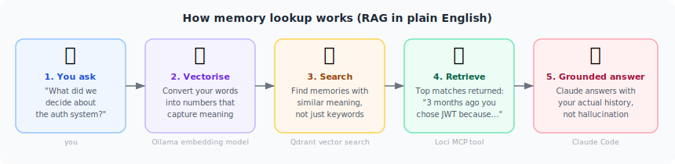

# Loci — Concepts for Beginners

This guide assumes you know nothing about vector databases, embeddings, or AI memory.
If you already know those terms, skip to [ARCHITECTURE.md](ARCHITECTURE.md).

---

## The problem: AI agents have amnesia

Every time you start a new chat with Claude, it begins completely blank. It has no memory
of previous sessions, no knowledge of decisions you made together last week, no record of
what you tried and why it didn't work. You have to explain your project from scratch every
single time.

This is not a bug — it's how large language models are designed. They process a single
"context window" of text and then that window closes. Nothing carries over.


The result: your AI assistant is incredibly capable inside a session, but incapable of
learning across sessions. It can't accumulate expertise about your specific project. It
can't remember that you decided against approach X for a good reason three months ago.

Loci fixes this.

---

## What Loci is

Loci is an **external memory system** that Claude (and other AI agents) can read from and
write to, just like a human might take notes in a notebook and look them up later.

It runs as a separate service alongside your AI agent. When Claude needs to remember
something, it writes to Loci. When it needs to recall something, it asks Loci. The agent
stays stateless — Loci provides the continuity.

Think of it like the difference between:
- **Without Loci:** A brilliant consultant who gets full amnesia every morning
- **With Loci:** The same consultant who keeps meticulous notes and reviews them before every meeting

---

## How memory lookup works

Loci uses a technique called **RAG** (Retrieval-Augmented Generation). The name is
technical; the concept is not.



Here's what happens when Claude asks Loci "do we have any context on the auth system?":

1. **Convert to numbers** — Your question is passed through an embedding model (Ollama,
   running locally). The model converts the words into a list of ~768 numbers that capture
   the *meaning* of the question — not just the words.

2. **Search by meaning** — Those numbers are compared against every stored memory in
   Qdrant (the vector database). Memories with *similar meaning* score high, even if they
   use completely different words. This is semantic search.

3. **Return the top matches** — The closest matches are retrieved and handed back to Claude
   as context before it answers.

4. **Answer with history** — Claude now answers based on your actual project history, not
   on general training data or guesswork.

The key insight: "similar meaning" finds things that keyword search misses. If you stored
"we went with JWT because the team already had experience with it," Loci will find that
when you ask "what authentication approach did we pick and why?" — even though the words
are completely different.

---

## The three parts of Loci

### 1. The MCP server (the interface)

MCP stands for **Model Context Protocol** — a standard that lets AI tools like Claude Code
call external functions. Think of it like browser extensions, but for AI agents.

Loci ships 25 MCP tools that Claude can call. They fall into five groups:


You don't have to use all of them. Most users start with `rag_context_search` (lookup) and
`investigation_store` (save a finding) and gradually discover the rest.

### 2. Qdrant — the vector database (the long-term memory)

[Qdrant](https://qdrant.tech) is a database that stores memories as vectors (lists of
numbers) and searches them by meaning. It's what makes semantic recall possible.

You run it locally or on your own server — your data never leaves your infrastructure.
Loci connects to it via the `QDRANT_URL` environment variable.

**Analogy:** If a regular database is like a filing cabinet (find things by exact label),
Qdrant is like a librarian who has read every document and can say "this sounds related
to what you're looking for."

### 3. Mnemosyne — the SQLite substrate (fast structured recall)

Mnemosyne is a companion system (SQLite + FTS5 full-text search) that handles structured
recall: exact strings, bank-scoped storage, and fast synchronisation. Some operations are
faster or more precise in SQL than in vector search — Mnemosyne handles those.

You don't need to interact with Mnemosyne directly. Loci manages it automatically.

---

## What Loci unlocks

### Continuity across sessions
Sessions build on each other. Work you did in Session 1 is available in Session 7 without
you re-explaining it.

### Accumulated project knowledge
Over time, Loci learns your codebase, your decisions, your conventions, your team's
preferences. It becomes an increasingly accurate model of your specific project.

### Grounded answers (fewer hallucinations)
Before answering a question about your project, Claude checks Loci first. If Loci has
relevant history, Claude uses that instead of guessing. `memory_confidence` can even score
how trustworthy a given claim is before Claude asserts it.

### Claim validation
`investigation_pre_answer_check` lets Claude check a proposed answer against stored
evidence before saying it. This reduces confident-sounding wrong answers significantly.

### Multi-agent memory sharing
The A2A (Agent-to-Agent) server lets multiple AI agents share a common memory pool. One
agent can store a finding; another can retrieve it without any message-passing between
them. They coordinate through shared memory.

### Supply chain security
The grounding hooks scan every tool call Claude makes against known patterns for supply
chain attacks (malicious `curl | bash` pipelines, prompt injection in AGENTS.md files,
etc.) and block or audit them before they execute.

### Bio-inspired memory lifecycle
Loci runs background consolidation processes inspired by how human memory works:
- **Slow-wave consolidation** — important memories are strengthened periodically
- **Glymphatic sweep** — old, low-importance memories are pruned to keep the store clean
- **FSRS spaced repetition** — memories due for review surface at the right time
- **Ebbinghaus decay** — confidence in a memory decays without reinforcement

These run automatically as cron jobs. You don't have to think about them.

---

## What you need to run Loci

| Requirement | What it is | Free? |
|---|---|---|
| [Qdrant](https://qdrant.tech) | Vector database | Yes (self-hosted) |
| [Ollama](https://ollama.ai) | Local LLM / embedding runner | Yes |
| `nomic-embed-text` model | The embedding model | Yes (`ollama pull nomic-embed-text`) |
| Python 3.11+ | Runtime for the MCP server | Yes |
| Claude Code | The AI client that uses Loci | Anthropic account required |

Everything except Claude Code runs locally on your machine or your own server.

---

## Minimal setup (5 minutes)

```bash
# 1. Clone and install
git clone https://github.com/rjmendez/loci
cd loci/mcp
python3 -m venv .venv && .venv/bin/pip install -e "."

# 2. Configure
cp ../.env.example .env
# Edit .env — set QDRANT_URL and OLLAMA_BASE_URL at minimum

# 3. Start
.venv/bin/python server.py

# 4. Wire into Claude Code (add to ~/.claude/settings.json):
# "loci": {
#   "type": "stdio",
#   "command": "/path/to/.venv/bin/python3",
#   "args": ["/path/to/loci/mcp/server.py"],
#   "env": { "QDRANT_URL": "...", "OLLAMA_BASE_URL": "..." }
# }
```

For Docker, systemd, and full-stack deployment → [docs/DEPLOYMENT.md](DEPLOYMENT.md).

---

## Glossary

| Term | Plain meaning |
|---|---|
| **Embedding** | Converting text into a list of numbers that capture its meaning |
| **Vector** | That list of numbers (typically 768 of them) |
| **Semantic search** | Finding things by meaning, not just matching words |
| **RAG** | Fetching relevant past context before generating an answer |
| **MCP** | A protocol that lets Claude call external tools (like Loci) |
| **Qdrant** | The vector database that stores and searches your memories |
| **Mnemosyne** | The SQLite companion database for fast structured recall |
| **A2A** | Agent-to-Agent — the HTTP server for multi-agent memory sharing |
| **Investigation** | A named research session that groups related findings |
| **Consolidation** | Background process that deduplicates and merges stored memories |
| **Grounding** | Injecting relevant past context into a prompt before it runs |
| **Confidence** | Loci's score for how trustworthy a stored claim is |

---

## Where to go next

| Goal | Resource |
|---|---|
| Deploy on a server or in Docker | [docs/DEPLOYMENT.md](DEPLOYMENT.md) |
| Understand the full architecture | [docs/ARCHITECTURE.md](ARCHITECTURE.md) |
| See every script and what it does | [docs/COMPONENTS.md](COMPONENTS.md) |
| Configure cron jobs and tuning | [docs/OPERATIONS.md](OPERATIONS.md) |
| Read the research foundations | [docs/COGNITIVE_FOUNDATIONS.md](COGNITIVE_FOUNDATIONS.md) |
| Full MCP tool reference | [mcp/README.md](../mcp/README.md) |
