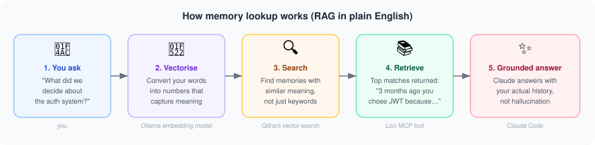
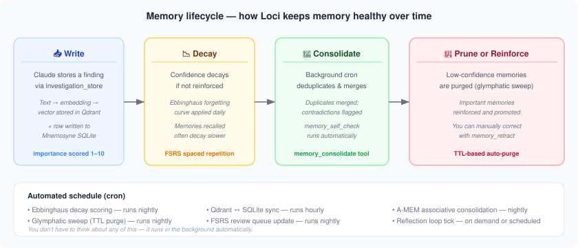

# Loci — Concepts for Beginners

This guide assumes you know nothing about vector databases, embeddings, or AI memory.
If you already know those terms, skip to [ARCHITECTURE.md](ARCHITECTURE.md).

---

## The problem: AI agents have amnesia

Every time you start a new chat with Claude, it begins completely blank. It has no memory
of previous sessions, no knowledge of decisions you made together last week, no record of
what you tried and why it didn't work. You have to explain your project from scratch every
single time.

This is not a bug — it's how large language models are designed. They process a single
"context window" of text and then that window closes. Nothing carries over.


The result: your AI assistant is incredibly capable inside a session, but incapable of
learning across sessions. It can't accumulate expertise about your specific project. It
can't remember that you decided against approach X for a good reason three months ago.

Loci fixes this.

---

## What Loci is

Loci is an **external memory system** that Claude (and other AI agents) can read from and
write to, just like a human might take notes in a notebook and look them up later.

It runs as a separate service alongside your AI agent. When Claude needs to remember
something, it writes to Loci. When it needs to recall something, it asks Loci. The agent
stays stateless — Loci provides the continuity.

Think of it like the difference between:
- **Without Loci:** A brilliant consultant who gets full amnesia every morning
- **With Loci:** The same consultant who keeps meticulous notes and reviews them before every meeting

---

## How memory lookup works

Loci uses a technique called **RAG** (Retrieval-Augmented Generation). The name is
technical; the concept is not.



Here's what happens when Claude asks Loci "do we have any context on the auth system?":

1. **Convert to numbers** — Your question is passed through an embedding model (Ollama,
   running locally). The model converts the words into a list of ~768 numbers that capture
   the *meaning* of the question — not just the words.

2. **Search by meaning** — Those numbers are compared against every stored memory in
   Qdrant (the vector database). Memories with *similar meaning* score high, even if they
   use completely different words. This is semantic search.

   Loci runs a keyword search at the same time (BM25, the classic
   match-the-actual-words method) and fuses the two rankings. Meaning-search alone
   misses exact identifiers — a function name, an error code — because those carry
   little "meaning" to an embedding model. Words-search alone misses everything
   phrased differently. Neither is good enough on its own.

3. **Return the top matches** — A second, slower model called a *reranker* reads each
   candidate together with the question and rescores it. Cheap search casts a wide net;
   the reranker picks. The survivors are handed back to Claude as context before it
   answers.

4. **Answer with history** — Claude now answers based on your actual project history, not
   on general training data or guesswork.

The key insight: "similar meaning" finds things that keyword search misses. If you stored
"we went with JWT because the team already had experience with it," Loci will find that
when you ask "what authentication approach did we pick and why?" — even though the words
are completely different. Ask instead about `_verify_bearer_token` and it is the keyword
half that saves you. That is why both lanes run.

---

## The four parts of Loci

### 1. The MCP server (the interface)

MCP stands for **Model Context Protocol** — a standard that lets AI tools like Claude Code
call external functions. Think of it like browser extensions, but for AI agents.

Loci ships 73 MCP tools that Claude can call. The map below groups the most commonly used
ones into five families:


You don't have to use all of them. Most users start with `rag_context_search` (lookup) and
`investigation_store` (save a finding) and gradually discover the rest.

### 2. Qdrant — the vector database (the search index)

[Qdrant](https://qdrant.tech) is a database that stores memories as vectors (lists of
numbers) and searches them by meaning. It's what makes semantic recall possible.

You run it locally or on your own server — your data never leaves your infrastructure.
Loci connects to it via the `QDRANT_URL` environment variable.

**Analogy:** If a regular database is like a filing cabinet (find things by exact label),
Qdrant is like a librarian who has read every document and can say "this sounds related
to what you're looking for."

One thing Qdrant is *not*: the place your findings live. Findings are written to plain
JSONL files on disk (one directory per investigation, under `~/.hermes/memory-sessions`).
Qdrant is an index over those files and can be rebuilt from them. If Qdrant is down or
unreachable, every Loci tool degrades to a slower path rather than losing anything.

### 3. The code graph (how findings connect to code)

Loci parses your source with tree-sitter and stores the result — files, symbols, and the
`calls` / `defines` / `imports` edges between them — in an embedded graph database
(LadybugDB, one file at `~/.hermes/memory-sessions/graph.ladybug`). Your findings are
stored in the *same* graph, linked to the symbols they talk about.

That link is what makes questions like "which past findings touch this function I'm about
to change?" answerable at all. Semantic search can only find text that sounds similar; the
graph knows what actually calls what. On the live corpus this is 11,273 symbols and 718
finding→symbol links.

### 4. Mnemosyne — the SQLite substrate (fast structured recall)

Mnemosyne is a companion system (SQLite + FTS5 full-text search) that handles structured
recall: exact strings, bank-scoped storage, and fast synchronisation. Some operations are
faster or more precise in SQL than in vector search — Mnemosyne handles those.

You don't need to interact with Mnemosyne directly. Loci manages it automatically. It is
optional: install `loci-mcp[mnemosyne]` for it, or omit it and run Qdrant-only.

---

## What Loci unlocks

### Continuity across sessions
Sessions build on each other. Work you did in Session 1 is available in Session 7 without
you re-explaining it.

### Accumulated project knowledge
Findings accumulate: decisions, dead ends, confirmed behaviour. Nothing about this is
automatic learning — Loci stores what agents write to it, and a finding nobody stored is
not there. The corpus on the machine these docs were written against is 146 investigations
holding 2,922 findings.

### Grounded answers (fewer hallucinations)
Before answering a question about your project, Claude checks Loci first. If Loci has
relevant history, Claude uses that instead of guessing. `memory_confidence` can even score
how trustworthy a given claim is before Claude asserts it.

### Claim validation
`investigation_pre_answer_check` lets Claude check a proposed answer against stored
evidence before saying it.

The interesting part is what it refuses to accept as evidence. A memory that merely *looks
similar* to your claim is not proof of your claim — everything in one investigation looks
similar to everything else in it. Measured: on 300 claims lifted verbatim from an unrelated
investigation, a plain similarity threshold called 88% of them supported. Requiring the
matching memory to also share actual words with the claim, and to stand out from its own
neighbours rather than being one of a uniformly-close crowd, took that to 1.7% while still
confirming 80% of genuinely supported claims. Matches that fail the stricter test are still
shown — labelled as candidates, not as support.

### Multi-agent memory sharing
The A2A (Agent-to-Agent) server lets multiple AI agents share a common memory pool. One
agent can store a finding; another can retrieve it without any message-passing between
them. They coordinate through shared memory.

It is a separate process you start yourself, and unlike the MCP server it binds all
interfaces by default. Set `HERMES_A2A_TOKEN` before running it anywhere reachable —
without one it still starts, and only warns.

### Supply chain security
A hook scans the tool calls Claude makes against known patterns for supply chain attacks
(malicious `curl | bash` pipelines, pipe-to-interpreter, base64-encoded exec, prompt
injection in AGENTS.md files) and writes them to an audit log at
`~/.hermes/logs/tool-audit.log`. Read-only tools are allowlisted out, so the log holds
the calls that can actually change something.

By default it **audits, it does not block** — set `HOOK_BLOCK_MODE=1` to refuse. The one
exception is an injection pattern in something being written to an agent-config file
(`AGENTS.md`, `CLAUDE.md`, `.cursorrules`), which is blocked either way: that file becomes
instructions to the next agent, so treating it as ordinary content is how an injection
survives the session that introduced it.

### Bio-inspired memory lifecycle
Loci ships background consolidation processes inspired by how human memory works:



- **Sharp-wave-ripple replay** (`swr_replay.py`) — the most salient recent findings are
  replayed together and compressed into one consolidated abstraction
- **Glymphatic sweep** (`glymphatic_sweep.py`) — superseded verdicts, orphaned sessions,
  dangling graph edges, and near-duplicate points are cleared out
- **FSRS spaced repetition / Ebbinghaus decay** (`ebbinghaus_consolidation.py`) — confidence
  decays without reinforcement, and memories due for review are re-embedded

**These are run by hand, not on a timer.** They are scripts in `scripts/`, not scheduled
jobs, and nothing schedules them for you. What *is* scheduled is a separate grooming tier
(`scripts/loci_groom.py`, four cron entries) that keeps the Qdrant index in step with the
findings on disk, proposes tags, links findings to code symbols, and writes investigation
summaries. See [ARCHITECTURE.md](ARCHITECTURE.md) for what runs when.

---

## What you need to run Loci

| Requirement | What it is | Free? |
|---|---|---|
| [Qdrant](https://qdrant.tech) | Vector database | Yes (self-hosted) |
| [Ollama](https://ollama.ai) | Local LLM / embedding runner | Yes |
| `nomic-embed-text` model | The embedding model | Yes (`ollama pull nomic-embed-text`) |
| Python 3.11+ | Runtime for the MCP server | Yes |
| Claude Code | The AI client that uses Loci | Anthropic account required |

Everything except Claude Code runs locally on your machine or your own server.

Two Ollama settings, not one. Embedding and generation are configured separately
(`OLLAMA_BASE_URL` vs `LOCI_OLLAMA_GEN_URL`), because they are often different hosts —
and pointing generation at an embedding-only host is a failure that looks like a healthy
server: it answers, it just has no generation model. The tools that generate text (tag
proposals, summaries, `llm_local`) need a generation model such as `qwen2.5:3b`; search,
recall, and the code graph do not.

---

## Minimal setup (5 minutes)


```bash
# 1. Clone and install
git clone https://github.com/rjmendez/loci
cd loci/mcp
python3 -m venv .venv && .venv/bin/pip install -e "."

# 2. Configure
cp ../.env.example .env
# Edit .env — set QDRANT_URL and OLLAMA_BASE_URL at minimum

# 3. Start
.venv/bin/python server.py

# 4. Wire into Claude Code. A session started inside this checkout picks the
#    server up from the checked-in .mcp.json. From anywhere else, add absolute
#    paths to ~/.claude/settings.json:
# "loci": {
#   "type": "stdio",
#   "command": "/path/to/.venv/bin/python3",
#   "args": ["/path/to/loci/mcp/server.py"],
#   "env": { "QDRANT_URL": "...", "OLLAMA_BASE_URL": "..." }
# }

# 5. Install the hooks (this is what makes grounding happen automatically)
../scripts/hooks/install.sh
../scripts/hooks/install.sh --check    # later: report drift, change nothing
```

Step 5 is easy to skip and easy to get wrong quietly. Steps 1–4 give Claude tools it
can *choose* to call; the hooks are what put relevant memory in front of it every turn
without being asked. And because the installed copies can be edited in place, they drift
from the repo — `--check` is how you find out, and it has caught a drift that would have
silently disabled a hook on the next install.

For Docker, systemd, and full-stack deployment → [docs/DEPLOYMENT.md](DEPLOYMENT.md).

---

## Glossary

| Term | Plain meaning |
|---|---|
| **Embedding** | Converting text into a list of numbers that capture its meaning |
| **Vector** | That list of numbers (typically 768 of them) |
| **Semantic search** | Finding things by meaning, not just matching words |
| **Keyword / BM25 search** | Finding things by the actual words — good at exact names and codes |
| **Hybrid search** | Running both and fusing the two rankings |
| **Reranker** | A slower model that rescores a shortlist by reading query and result together |
| **RAG** | Fetching relevant past context before generating an answer |
| **MCP** | A protocol that lets Claude call external tools (like Loci) |
| **Qdrant** | The vector database that indexes and searches your memories |
| **Code graph** | Files, symbols, and their call/import edges, stored so findings can link to them |
| **Mnemosyne** | The SQLite companion database for fast structured recall |
| **A2A** | Agent-to-Agent — the HTTP server for multi-agent memory sharing |
| **Investigation** | A named research session that groups related findings |
| **Consolidation** | Background process that deduplicates and merges stored memories |
| **Grounding** | Injecting relevant past context into a prompt before it runs |
| **Confidence** | Loci's score for how trustworthy a stored claim is |

---

## Where to go next

| Goal | Resource |
|---|---|
| Deploy on a server or in Docker | [docs/DEPLOYMENT.md](DEPLOYMENT.md) |
| Understand the full architecture | [docs/ARCHITECTURE.md](ARCHITECTURE.md) |
| See every script and what it does | [docs/COMPONENTS.md](COMPONENTS.md) |
| Configure cron jobs and tuning | [docs/OPERATIONS.md](OPERATIONS.md) |
| Read the research foundations | [docs/COGNITIVE_FOUNDATIONS.md](COGNITIVE_FOUNDATIONS.md) |
| Full MCP tool reference | [mcp/README.md](../mcp/README.md) |
